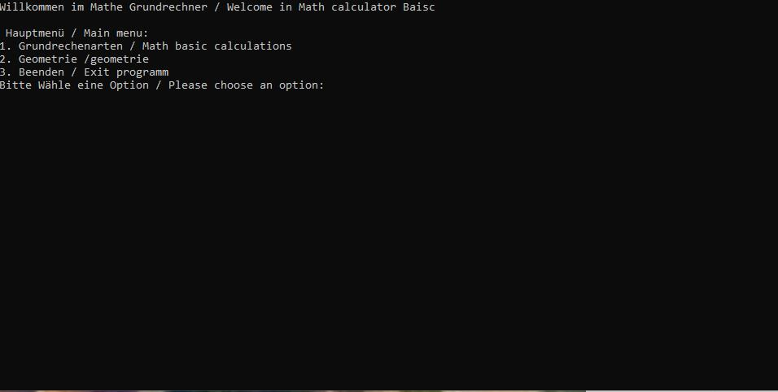
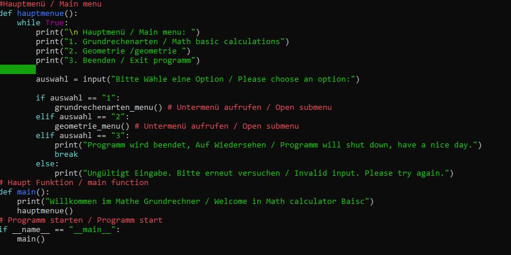

# Python Math Calculator — Python Mathematik-Rechner  
**B.E.G.-System Core Tool (Source-Available Licensed Software)**

A fully functional Python math calculator with a console menu interface.  
Supports basic arithmetic operations and serves as a foundation for further expansion  
(fractions, roots, scientific functions, geometry, etc.).  
Designed for education, research, development and AI-enhanced workflows.

 ✦ Features:

- Console-based interactive menu
- Supports addition, subtraction, multiplication, division (more planned)
- Modular structure for expandable math domains
- Clean and beginner-friendly Python codebase
- Suitable for students, developers and production integration

 ✦ Download / Full Version (.zip):

The complete ZIP version (including all files) is available here:  
https://babhuegoa.gumroad.com/l/tsnot

The code may be integrated into own projects under the terms  
of the B.E.G.-System Core Tool License.

✦ Usage:

You will need Python 3.11 or an Python 3.x Version to start the code via
Python itself or double click on the codefile and if you have the right pytohn version it should start.
Within Python you need to type: python3 mathUm_friverr.

✦ Preview

✦ License:

This project is licensed under the
B.E.G.-System Basiswerkzeug Lizenz / B.E.G.-System Core Tool License
-Commercial use permitted
-Attribution required: “Based on the B.E.G. System by Emanuel Goas”
-No redistribution of the source code itself
-See LICENSE file for full text

News and Information:
If you want to get news about my Project and like to be well informed you can suscribe to my Gumroad channel.
All news and Procejt information will be first send and published there.
link: https://babhuegoa.gumroad.com/subscribe

✦ Repository Purpose:

This repository serves as public documentation and preview.
The runnable ZIP version is distributed exclusively via Gumroad.
